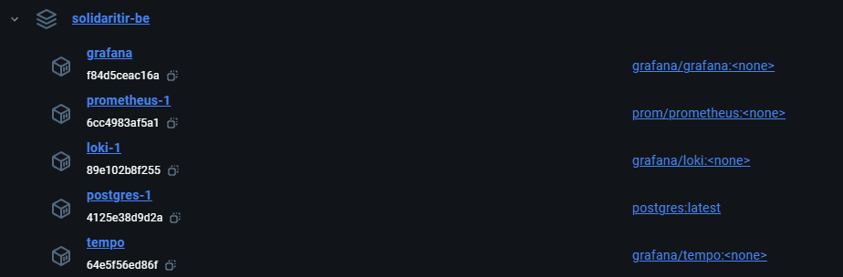

# SolidariTIR

<div align="center">
    

**SolidariTir** is a web application designed for small to medium-sized NGOs and collectives to help them manage the
collection of donated goods.

The platform aims to streamline the process of accepting donations, tracking inventory, organizing collection points and
generating reports.

[Overview](#-overview) •
[Features](#-features) •
[Getting started](#-getting-started) •
[Contributing](#-contributing) •
[Feedback and support](#-feedback-and-support) •
[License](#-license) •
[Contacts](#-contacts)

</div>

## Overview

## Features

- **Donation management**: add and track donated items from individuals, groups and companies.
- **Inventory tracking**: real-time updates on stock levels to ensure the most needed items are prioritized.
- **Measuring unit support**: out of the box support for SI units to keep track of the weight of boxes.
- **Volunteers management**: assign roles and tasks to volunteers who assist in managing donations, inventory and
  logistics.
- **Reporting and analytics**: generate reports to analyze donation trends and optimize future collection efforts.

## Getting started

### Back-end

> [!NOTE]
> This projects uses spring docker compose support. To be able to leverage it during your
> development, [Docker](https://www.docker.com/) is required.

> [!NOTE]
> For an improved developer experience, the development configuration of the projects uses the observability stack
> (Prometheus, Grafana, Loki, Tempo) in combination to docker compose support and spring dev-tools.
> This will allow you to monitor performance, query logs, follow traces and leverage fast reload times after changes.

1. Clone the backend repo:

   ```git clone https://github.com/moonbox-org/solidaritir-be.git```

2. Run the project from the IDE or through maven with ```dev``` profile active and wait for the containers to start:

   ```mvn spring-boot:run -Dspring-boot.run.profiles=dev```

<div align="center">
    <div>This will be the list of containers created by the command</div>
    
</div>

3. To check that everything is up and running, visit the following URL in your browser and check the demo endpoint:
    - http://localhost:3000 (Grafana | username: ```admin```, password: ```admin```)
    - http://localhost:8080/demo (Hello world endpoint)

> [!NOTE]
> Grafana dashboards and datasources will be configured automatically.
>
> PostgreSQL database will be created automatically and will expose port '5454' for connections with external clients.
> You can statically assign a port by adding it to the postgres service in the [compose-dev.yml](compose-dev.yml).

4. Happy coding.

## Contributing

## Feedback and support

## License

This project is licensed under the GNU General Public License v3.0.

You can read the full license [here](LICENSE).

## Contact
